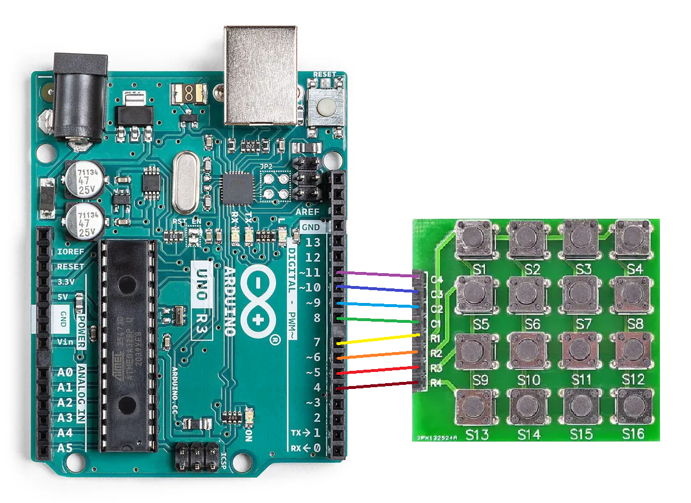

# avr-button-matrix

avr-button-matrix is a barebones, easy to use library written in AVR-GCC for any AVR microcontroller

## Installation (Linux/WSL)
***WARNING:*** Must have AVR-GCC installed before installing and using library

Use git-clone to clone repo to global include path

```bash
git clone git@github.com:EverleeJ/avr-button-matrix.git /usr/include/avr-button-matrix
```

## Usage
**See [example](https://github.com/EverleeJ/avr-button-matrix/tree/main/example/example.c)** for full example project

**NOTE:** This example depends on the configuration shown in image below:



Library depends upon the initialization of `matrix_config()` in src - delcared as a prototype in button_matrix.h

`matrix_config()` should initialize and return the `config` type - also declared in button_matrix.h

```c
config matrix_config(void) {
  config conf;

  conf.ROW_PORT = PORTD;
  conf.ROW_DDR  = DDRD;
  conf.COL_PORT = PORTB;
  conf.COL_DDR  = DDRB;
  conf.COL_PIN  = PINB;

  conf.ROWS = 4;
  conf.COLS = 4;

  conf.FIRST_ROW = 4;
  conf.FIRST_COL = 0;

  conf.ROW_MASK = 0b11110000;  // last 4 bits of PORTD for row
  conf.COL_MASK = 0b001111;    // first 4 bits of PORTB for col

  return conf;
}
```

After initialization of `matrix_config` the rest of the set up can be done in any function that uses the button matrix, for this example we will use `main()`

To set up the initialize the data direction and ports, we will use `matrix_init()`, which pulls the values from previously initialized `matrix_config()`

To recieve output from the button matrix, use `matrix_out()`

To use `matrix_out`, a variable representing the output, should be declared using type `uint8_t`, and initialized with the value of `matrix_out()`: `uint8_t out = matrix_out()`

By default (no button press), `matrix_out()` returns 0, when a button is pressed, it should return the number of that button, relative to the location of the ROW and COL pins

Below is an example using values of the previously shown `matrix_config()` that blinks the onboard Arduino Uno LED (PORTB5) when a button is pressed

```c
int main(void) {
  matrix_init();

  DDRB |= (DDB5 << 1);  // LED DDR set to output

  for (;;) {
    uint8_t out = matrix_out();
    if (out != 0) {
      PORTB &= ~(PORTB5 << 1);  // LED off
      _delay_ms(100);
    }
    PORTB |= (PORTB5 << 1);  // LED on
  }

  return 0;
}
```


## License
[MIT](https://github.com/EverleeJ/avr-button-matrix/blob/main/LICENSE)
